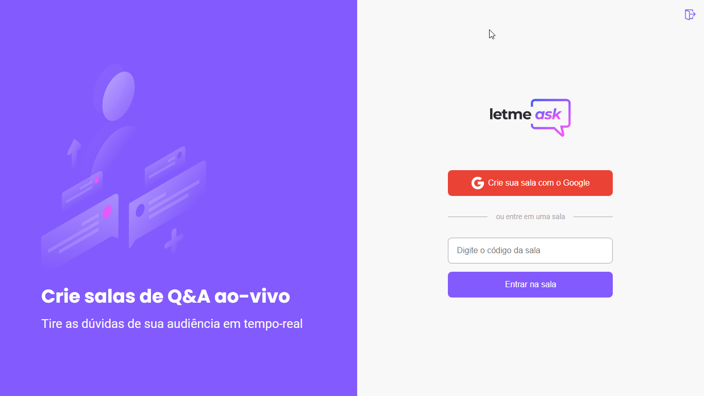

<p align="center">
  
</p>

<br>

<h1 align="center">
	
</h1>

# Acesso

Acesse a página da aplicação clicando [aqui](https://letmeask-eight.vercel.app).

## 🧪 Tecnologias

Esse projeto foi desenvolvido com as seguintes tecnologias:

- [TypeScript](https://www.typescriptlang.org/)
- [Firebase](https://firebase.google.com/)
- [React](https://reactjs.org)
- [Styled Components](https://www.styled-components.com)
- [ESLint](https://eslint.org)
- [Prettier](https://prettier.io/)

Para mais detalhes, veja o **[package.json](./package.json)**.

## 🚀 Como executar

Como pré-requisitos, é necessário instalar o [Node.js](https://nodejs.org/pt-br/) e o [Yarn](https://classic.yarnpkg.com/en/docs/install/) em suas versões LTS.

Cumprindo os pré-requisitos, clone o projeto e acesse a pasta do mesmo.

```bash
$ git clone https://github.com/alessandroramos13/letmeask
$ cd letmeask
```

Para iniciá-lo, siga os passos abaixo:

```bash
# Instalar as dependências
$ yarn

# Iniciar o projeto
$ yarn start
```

O app estará disponível no seu browser pelo endereço [http://localhost:3000](http://localhost:3000).

Lembrando que será necessário criar uma conta no [Firebase](https://firebase.google.com/) e um projeto para disponibilizar um Realtime Database.

## 💻 Projeto

Letmeask é perfeito para criadores de conteúdos poderem criar salas de Q&A com o seu público, de uma forma muito organizada e democrática.

Este é um projeto desenvolvido durante a **[Next Level Week Together](https://nextlevelweek.com/)**, apresentada dos dias 20 a 27 de Junho de 2021.

## 🔖 Layout

Você pode visualizar o layout do projeto através do link abaixo:

- [Layout Web](https://www.figma.com/file/u0BQK8rCf2KgzcukdRRCWh/Letmeask/duplicate)

Lembrando que você precisa ter uma conta no [Figma](https://figma.com/).

## 📝 License

Esse projeto está sob a licença MIT. Veja o arquivo [LICENSE](./LICENSE) para mais detalhes.

---
